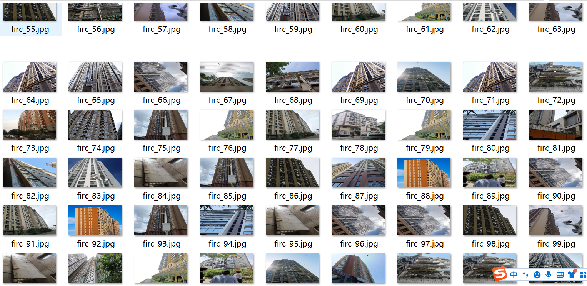
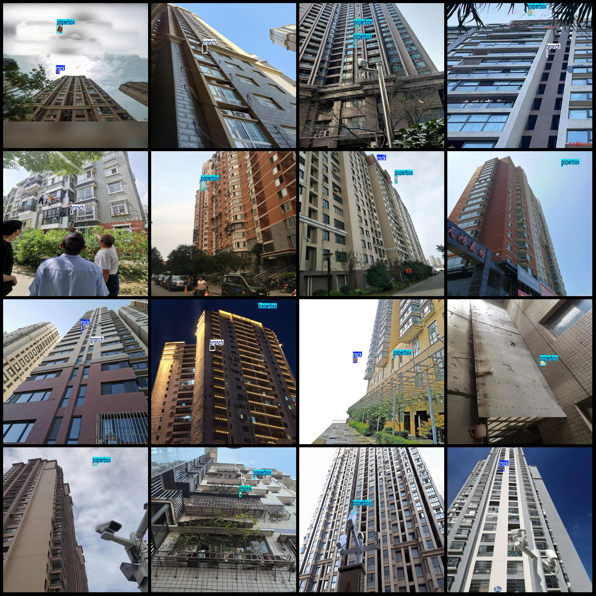
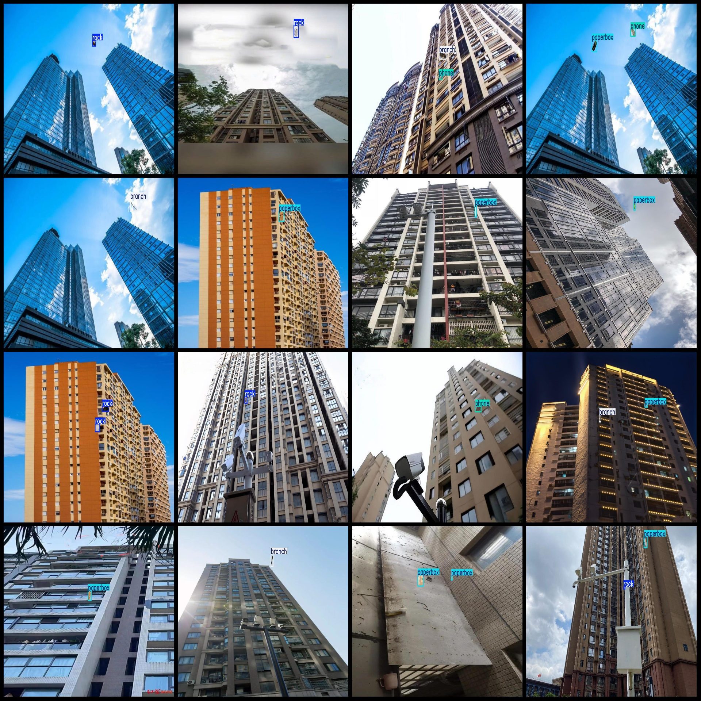
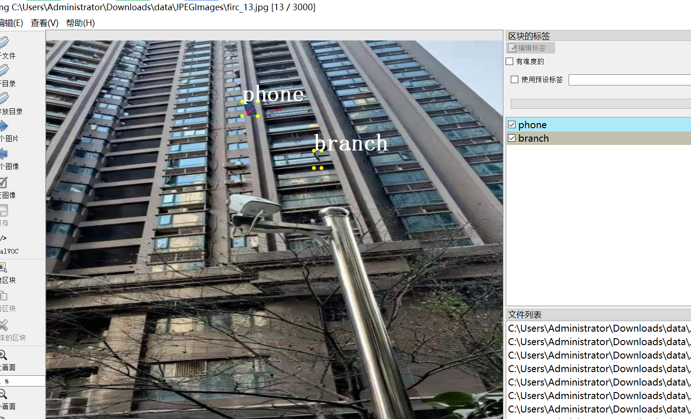

# High-Altitude Drop Detection Dataset VOC+YOLO in 3000 Images with 6 Categories

Dataset format: Pascal VOC format + YOLO format (txt file without split path, only containing jpeg images and corresponding VOC format xml files and YOLO format txt files)
Number of images (jpg file count): 3000
Number of annotations (xml file count): 3000
Number of annotations (txt file count): 3000
Number of annotation categories: 6
Annotation category names (note that the order of categories in the YOLO format may not match this, but refer to the "labels" folder's "classes.txt"): ["backpack", "branch", "laptop", "paperbox", 
"phone", "rock"]
Box counts for each category:
- backpack (backpack) box count = 40
- branch (branch) box count = 745
- laptop (laptop) box count = 38
- paperbox (paperbox) box count = 1944
- phone (phone) box count = 352
- rock (rock) box count = 1345
Total box count: 4464
Image resolution: 1920x1080
Annotation tools used: labelImg
Annotation rules: draw bounding boxes for categories
Important note: The dataset does not have separate training/validation/test sets; you need to partition it yourself.
Special declaration: This dataset does not guarantee the accuracy of the trained model or weight files.
Image preview:
Annotation examples:

## Images

Here is a pay link on Stripe ( https://buy.stripe.com/3cs8yP7sY87d0vu9AB ). Please contact me lonlonago@foxmail.com after funding $89, and I will send you a complete data files , thank you!

